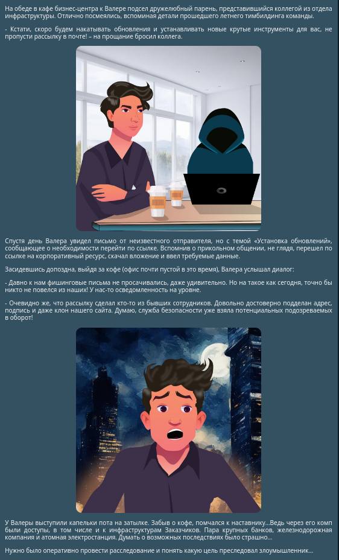

# итоговый отчёт команды "еденични"
##### github: https://github.com/d1temnd/nto_2024_finalReport

# Task-Based

>## WEB 1-10
>
>
>
>сайт представлял собой календарь-планировщик.
>посмотрев исходный код, была найдена ссылка на **file1.txt**.
>
>
>
>перейдя в этот файл, был найден хинт, что флаг находится в ___etc/secret___
>
>
>
>с помощью уязвимости LFI можно было открыть этот файл
>
>
>
>после скачивания файла был обнаружен флаг
>
>
>
>
>## flag: nto{P6t9_T77v6RsA1}

>### WEB 2-20
>
>дано: [исходный код](src/web2/77bdeeb2-e181-4b94-b11d-9b851a1d87c3_legacy.jar)
>
>
>
>декомпилировав код с помощью программы **jd-gui** и посмотрев классы java, были найдены страницы **doc/** в которую можно передать параметр **document** и страница **/login**
>
>
>
>перейдя на страницу **/doc/** и передав параметр **document**, была получена ошибка template
>
>
>
>заглянув дальше в код, там был обработчик ошибки логина
>
>
>
>с помощью полезной нагрузки нужно было вызвать ошибку, удалив файл **password.txt**
>
>
>
>дальше нужно было вызвать проверку пароля в соседней вкладке, чтобы вернулся **flag**.
>
>
>
>
>
>## flag: nto{abobovichasdfas}

>### WEB 3-30
>
>Дано: **/src/web3/app**
>
>
>
>сайт представляет из себя страницу для генерации открыток на 8 марта
>
>
>
>при попытке ввода имени перекидывает на страницу **/flag**, на которой ошибка доступа 403
>
>
>
>в исходном коде он запрашивает параметр **name**
>
>
>
>с помощью байпаса 403 ошибки и уязвимости **SSTI** нужно передать этот параметр
>
>проверка на уязвимость **SSTI**
>
>
>
>используя питон код 
>**request.application.__globals__.__builtins__.__import__('os').popen('cat flag.txt').read()**
>
>читаем файл **flag.txt** и в ответ он возвращает **flag**
>
>
>
>## flag: nto{Ht1P_sM088Lin6_88Ti}

# forensics
> дано: **виртуальная машина на системе windows** 
>
>легена: 
>
>
>

> ### 1. Каким образом вредоносное ПО попало на компьютер пользователя?</h3>
>в легенде говорится, что Валера скачал файлы из фишингово письма и установил их самостоятельно
